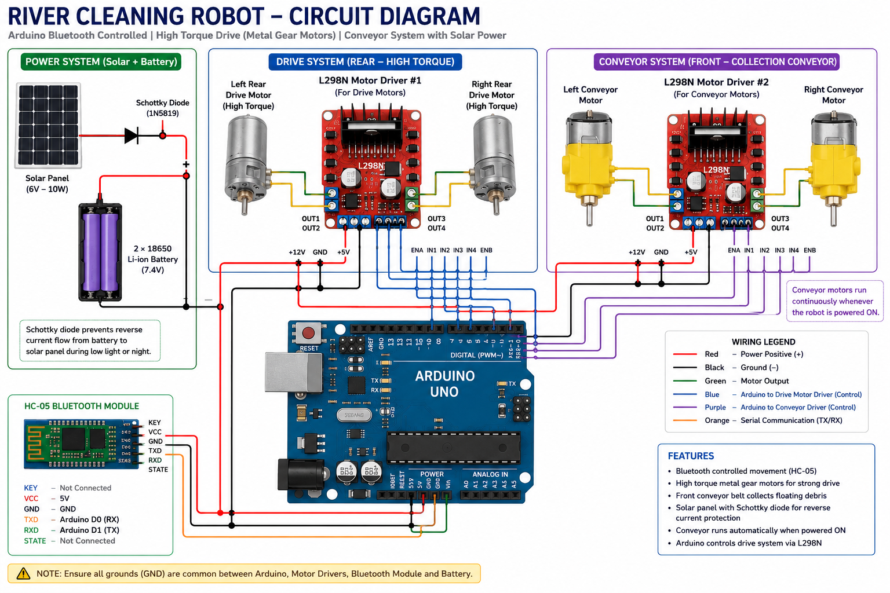

# River Cleaning Robot

An Arduino-based Bluetooth-controlled prototype designed to collect floating debris from water bodies using a conveyor belt mechanism. The project demonstrates embedded systems, motor control, renewable energy integration, and mechanical design concepts.

---

## Features

- Bluetooth-controlled navigation (HC-05)
- Differential drive using rear motors
- Conveyor belt for floating waste collection
- Solar-assisted power supply
- Schottky diode for reverse current protection
- Arduino Uno based control system
- Modular design for future autonomous upgrades

---

## Hardware Used

- Arduino Uno
- HC-05 Bluetooth Module
- L298N Motor Driver
- 2 × High-torque DC motors (Drive)
- 2 × DC motors (Conveyor)
- Solar Panel
- Schottky Diode
- 2 × 18650 Li-ion Batteries

---

## Circuit Diagram

---

## Repository Contents

- `RiverCleaningRobot.ino` – Arduino source code
- `Circuit diagram.png` – Wiring diagram

---

## Future Improvements

- Autonomous navigation
- Obstacle avoidance
- Computer vision for waste detection
- Water quality monitoring
- GPS integration
- IoT monitoring dashboard

---

## License

This project is licensed under the MIT License.
